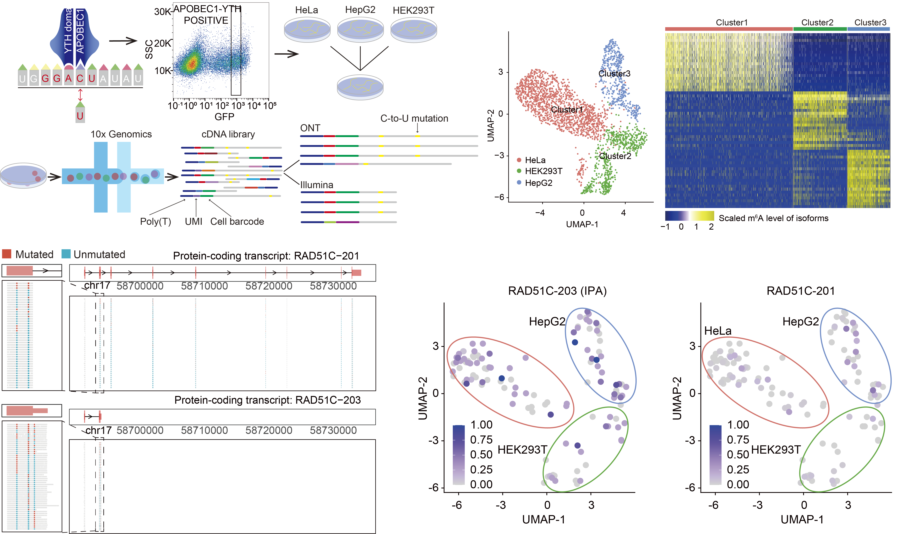

# m6A-isoSC-seq


Here, we develop m6A-isoSC-seq, which employs both Oxford Nanopore long-read and Illumina short-read sequencing on the same 10x Genomics single-cell cDNA library with APOBEC1-YTH induced C-to-U mutations near m6A sites. Through m6A-isoSC-seq on a pooled sample of three cell line origins, we unveil a profound degree of m6A heterogeneity at both the isoform and single-cell levels. Through comparisons across single cells, we identify widespread specific m6A methylation on certain RNA isoforms, usually those misprocessed RNA isoforms.

## Table of Contents
- **[Running m6A-isoSC-seq](#running-m6A-isoSC-seq)**<br>
- **[Getting Help](#getting-help)**<br>
- **[Contacts](#contacts)**<br>
- **[Citing](#citing-m6aiso)**<br>
- **[Contributors](#contributors)**<br>
- **[License](#license)**<br>

## Requirements
1. gatk (v3.8)
2. CTK-tools (v1.1.3)
3. Picard (v2.22.3)
4. STAR (v2.7.3a)
5. Python (v3.7)
6. numpy (v1.20.1)
7. m6Aiso (v1.0.0)
8. pandas (v1.2.4)
9. Sicelore (v2.0)
10. Samtools (v1.7)

## eDART-seq varient calling in illumina RNAseq data 
### Fig.1:varient calling and annotation

#### GATK based varient calling pipeline make:
```
    python varient_calling_pipeline.py 
                            --Fqfile <fastq file>
                            --Paried <paired-end data: True single-end data: False>
                            --Outpath <output paht>
                            --picard_path <picard soft path>
                            --gatk_path <gatk soft path>
                            --star_index <star mapping index>
                            --star_fasta <fasta using for index make>
                            --star_gtf <gtf using for index make>
                            --vcf_path <already know snp file>
```
*Note: Please provide the genomic reference and make sure STAR, samtools, gatk and picard was installed.

#### The repeat, gene, strand and motif annotation of each C-to-U mutation:
```
    python pipeup_result_to_counts.PE.py 
                            -I1 <vcf result> 
                            -I2 <mpileup result> 
                            -O <count result>
    
    python snp_result_clean_based_count.py 
                            --input_snp_result <count result> 
                            --cleaned_snp_result <cleaned_snp_result>
 
    python snp_result_annotation_for_alu.py 
                            --repeat_file <repeat annotation> 
                            --genome_size_file <genome size> 
                            --fraction_file <cleaned snp result> 
                            --annotation_result <repeat annotated result> 
                            --binsize 10000

    python snp_result_annotation_for_gene.py
                            --snp_file <repeat annotated result>
                            --GenePred <GenePred table>
                            --genome_size_file <genome size file>
                            --output_file <gene annotated result>
                            --sequence_type <3_type,5_type>
    
    python snp_result_annotation_for_strand.py
                            --annotation_file <gene annotated result>
                            --sequence_type <fr-strand or rf-strand or non-strand>
                            --result_file <strand annotated result>
    
    python snp_result_annotation_for_motif.py
                            --strand_annotation_result <strand annotated result>
                            --fasta_file <hg38,mm10,or hg19 fasta file>
                            --result_file <motif annotated result>    
```

#### The peak calling based on C to U mutation:
```
   python merge_transcript_to_slide_windown.py
                            --input_merged_genePred <GenePred table>
                            --input_bin_size <100>
                            --input_slide_lenght <50>
                            --output_window_filename <splited window file name>
   bedtools intersect 
                            -a hg38_10X_genes_transMerge_slidewindow.bed 
                            -b eDART-seq_C_to_T_varient.bed 
                            -s 
                            -wao 
                            | >> intersect_result.bed
   python overlap_mutation_site_count.py
                            --input_intersect_result <intersect_result.bed>
                            --output_windown_mutation_count <counted_intersect_result.txt>
   python overlap_mutation_peakcalling.py
                            --counted_intersect_result <counted_intersect_result.txt>
                            --min_C_to_T_mutation_number <3,4,5>
                            --counted_peak_result <peak_result>
```


## The C-to-U mutation calling in illumina based single cell RNAseq data 
Fig.2:Singel cell varient calling and cell cluster

#### GATK based C to U mutation calling pipeline make:
```
    python umi_and_cellbarcode_fusion_to_fastq.py
                            --R1_fastq <fastq with read>
                            --R2_fastq <fastq with umi and cell barcode>
                            --output_fastq <call barcode and umi merged fastq>

    python ./Fig.2:Singel_cell_varient_calling_and_cell_cluster/varient_calling_pipeline.py 
                            --Fqfile <fastq file>
                            --Paried <paired-end data: True single-end data: False>
                            --Outpath <output paht>
                            --picard_path <picard soft path>
                            --gatk_path <gatk soft path>
                            --star_index <star mapping index>
                            --star_fasta <fasta using for index make>
                            --star_gtf <gtf using for index make>
                            --vcf_path <already know snp file>

    vartrix_linux 
                            --bam <cellranger output bam>
                            --cell-barcodes <cellranger output cellbarcode list>
                            --fasta <fasta genome file of hg38>
                            --vcf <vcf file of C to U mutation>
                            --umi 
                            --mapq 20 
                            --threads 30 
                            --scoring-method coverage 
                            --out-matrix <output_alt.matrix>
                            --ref-matrix <output_ref.matrix>

    python Single_cell_varient_matrix_to_table.py
                            --ref_matrix <output_ref.matrix>
                            --alt_matrix <output_alt.matrix>
                            --cell_barcode <cellranger output cellbarcode list>
                            --snp_vcf <vcf file of C to U mutation>
                            --cell_type_splited <False>
                            --snp_level_filename <output C to U mutation level file>
```

#### The repeat, gene, strand and motif annotation of each C to U mutation:
```
    python Single_cell_table_annotation_alu.py
                            --repeat_file <repeat annotation>
                            --genome_size_file <genome size>
                            --fraction_file <cleaned snp result>
                            --annotation_result <repeat annotated result>
                            --binsize 10000

    python Single_cell_table_annotation_gene.py
                            --snp_file <repeat annotated result>
                            --GenePred <GenePred table>
                            --genome_size_file <genome size file>
                            --output_file <gene annotated result>
                            --sequence_type <3_type,5_type>


    python Single_cell_table_annotation_strand.py
                            --annotation_file <gene annotated result>
                            --result_file <strand annotated result>
    
    python Single_cell_table_annotation_motif.py
                            --strand_annotation_result <strand annotated result>
                            --fasta_file <hg38,mm10,or hg19 fasta file>
                            --result_file <motif annotated result>

    python Single_cell_table_annotation_to_cleaned_snp.py
                            --type_annotation_result <motif annotated result>
                            --edit_cutoff_result <cleaned A2I editing result>
                            --snp_cutoff_result <cleaned C2T mutation result>
                            --min_pvalue <0.01>
                            --min_alt_depth <5>
                            --min_total_depth <20>
                            --min_mutation_ratio <0.01,0.05>

    python cleaned_mutation_to_vcf.py
                            --vcf_header_filename <vcf head file>
                            --bed_filename <cleaned C2T mutation result>
                            --output_vcf_filename <cleaned C to U mutation vcf file>
	

```
#### Single cell m6A rate matrix make:
```
	vartrix_linux
                            --bam <cellranger output bam>
                            --cell-barcodes <cellranger output cellbarcode list>
                            --fasta <fasta genome file of hg38>
                            --vcf <cleaned C to U mutation vcf file>
                            --umi
                            --mapq 20
                            --threads 30
                            --scoring-method coverage
                            --out-matrix <cleaned_output_alt.matrix>
                            --ref-matrix <cleaned_output_ref.matrix>

    python varixMatrix_to_cellLevel_count.py 
                            --matrix_filename <cleaned_output_alt.matrix or cleaned_output_ref.matrix made form vartrix_linux>
                            --barcode_filename <cell barcode list>
                            --vcf_filename <cleaned C to U mutation vcf result>
                            --output_matrix <converted_output_alt.matrix or converted_output_red.matrix>
    
    python varixMatrix_to_peak_based_Matrix.py
					        --ref_matrix_filename <cleaned_output_ref.matrix>
                            --alt_matrix_filename <cleaned_output_ref.matrix>
                            --cell_type_filename <cell barcode to cell type file>
                            --ref_matrix_resultname <peak_based_output_ref.matrix>
                            --alt_matrix_resultname <peak_based_output_ref.matrix>
                            --peakid_to_mutation_id_filename <peak name to mutation name file>
    
    python varixMatrix_to_peak_based_ratio.py
                            --ref_matrix_filename <peak_based_output_ref.matrix>
                            --alt_matrix_filename <peak_based_output_ref.matrix>
                            --cell_type_filename <cell barcode to cell type file>
                            --output_ratio_matrix <peak_based_output_rate.matrix>
```


## Calculate ref and alt matrix based on long read mapping result
### Fig.3:Nanopore varient calling and cell cluster

#### C-to-U mutation matrix make in ONT based single cell RNAseq data
```
    java -jar -Xmx220g Sicelore-2.0.jar SNPMatrix 
                            --CSV <cell_barcodes.tsv>
                            --INPUT <nh_isobam.bam>
                            --OUTPUT <snp_calling>
                            --SNP <C to U mutation calling in illumina RNA-seq>
                            --PREFIX <nh_c_to_t>
```
#### The mean and medium m6A level calculation of each isoform in single cell
```
    python varixMatrix_to_cellsplit_m6Alevel_mean.py 
                            --ref_matrix_filename <single cell ref matrix>
                            --alt_matrix_filename <single cell alt matrix>
                            --cell_type_filename <cell barcode to celltype table>
                            --output_mean_table <output mean mutation table>

	python varixMatrix_to_cellsplit_m6Alevel_medium.py
                            --ref_matrix_filename <single cell ref matrix>
                            --alt_matrix_filename <single cell alt matrix>
                            --cell_type_filename <cell barcode to celltype table>
                            --output_mean_table <output mean mutation table>

```

## Isoform m6A level calculation based on DRS data and m6Aiso
### Fig.4:Specifically_methylated_isoforms_in_single_cell
```
    nanopolish eventalign 
                            --reads <in.fasta> 
                            --bam <in.bam> 
                            --genome <transcriptome.fa> 
                            --signal-index
                            --scale-events 
                            --summary <summary.txt> | gzip > <out.tsv.gzip>

    python -m m6Aiso current_signal_abstract_for_m6A_pred 
                            --nanopolish_result <out.tsv.gzip>
                            --number <the number of each batchs>
                            --out_dir /path/to/output

```


## Intronic polyadenylation transcripts annotation
### Fig.5:IpA isoform methylation levels
```
python intron_apa_transcript_annotation.py
                            --GenePred_table <GenePred table>
                            --Intronic_APA_annotation_transcript <IPA annotated table>
```

## The distance of m6A to exon junction calculation
### Fig.6:NMD_and_retained-intron_isoform_methylation_levels
```
python m6A_to_EJC_distance_calculation.py
                            --bed_format_file <m6A bed format file>
                            --GenePred_file <GenePred table>
                            --EJD_annotated_file <EJD annotated file>
```

## The length of coding sequence in last exon calculation for each isoform
### Fig.7:CMD_mediated_misprocessed_isoform_degradation
```
python Protein_coding_transcript_annotation.py
                            --canonical_transcript_anno <transcript id to canonical transcript id table>
                            --GenePred_table <GenePred table>
                            --output_file <mulit coding sequence lenght annotated table>
```

# Getting help

We appreciate your feedback and questions! You can report any errors or suggestions related to m6A-isoSC-seq as an issue on [github](https://github.com/ZJRen9/m6A-isoSC-seq/issues).

# Contacts

Jinkai Wang: wangjk@mail.sysu.edu.cn
ZhiJun Ren: renzhj7@mail.sysu.edu.cn


# Citing m6Aiso

If you use m6A-isoSC-seq in your research, please cite
[Isoform characterization of m6A in single cells identifies its role in RNA surveillance](doi:XXXX)


# Contributors

This code is developed and maintaned by Jinkai Wang, [Zhijun Ren](https://github.com/ZJRen9), Xiang Huang and Yan Gao. If you want to contribute, please leave an issue or submit a pull request. We appreciate contributions on bug fixes and potential new features. Thank you!

# License
m6A-isoSC-seq is licensed under the terms of the MIT license.
